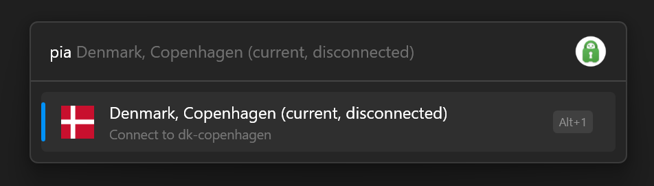
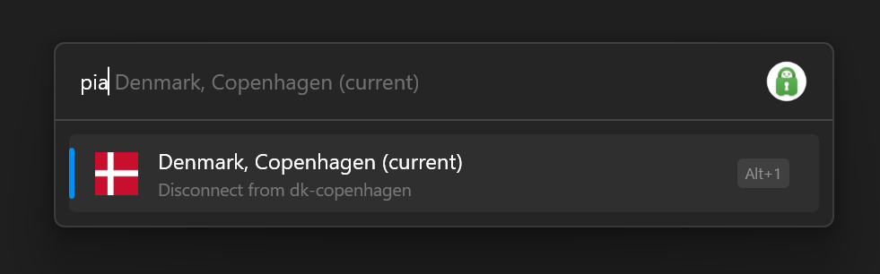
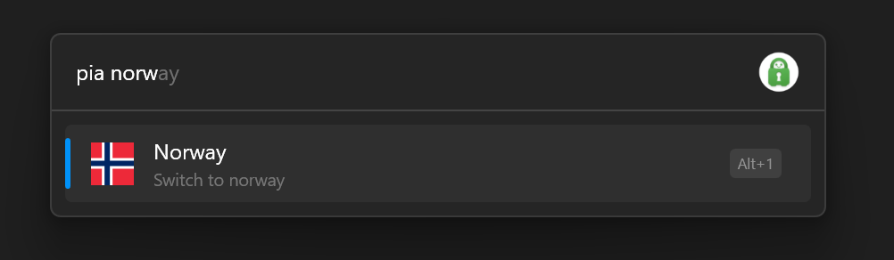

# Private Internet Access
A Flow.Launcher plugin for Private Internet Access.

Can connect and disconnect the VPN as well as change region.

## Usage

### Connect
If you are disconnected from the VPN, the default action is to connect.  

### Disconnect
If you are connected, the default action is to disconnect.  

### Switch region
If you start typing, you can search available regions to connect to.  
